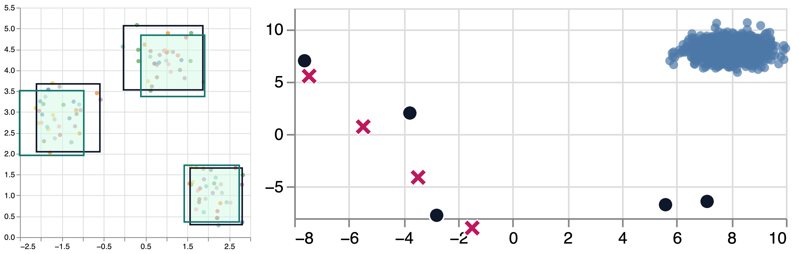

# Benchmark It Yourself (BIY): Preparing a Dataset and Benchmarking AI Models for Scatterplot-Related Tasks

Supplementary materials for the BIY paper.

## Benchmark

### Preview

<figure>
  
  <figcaption>A promising result for the cluster detection task (left) and an unsuccessful one for the outlier identification task (right). The X-shaped points are the outliers predicted by GPT-4o.</figcaption>
</figure>
